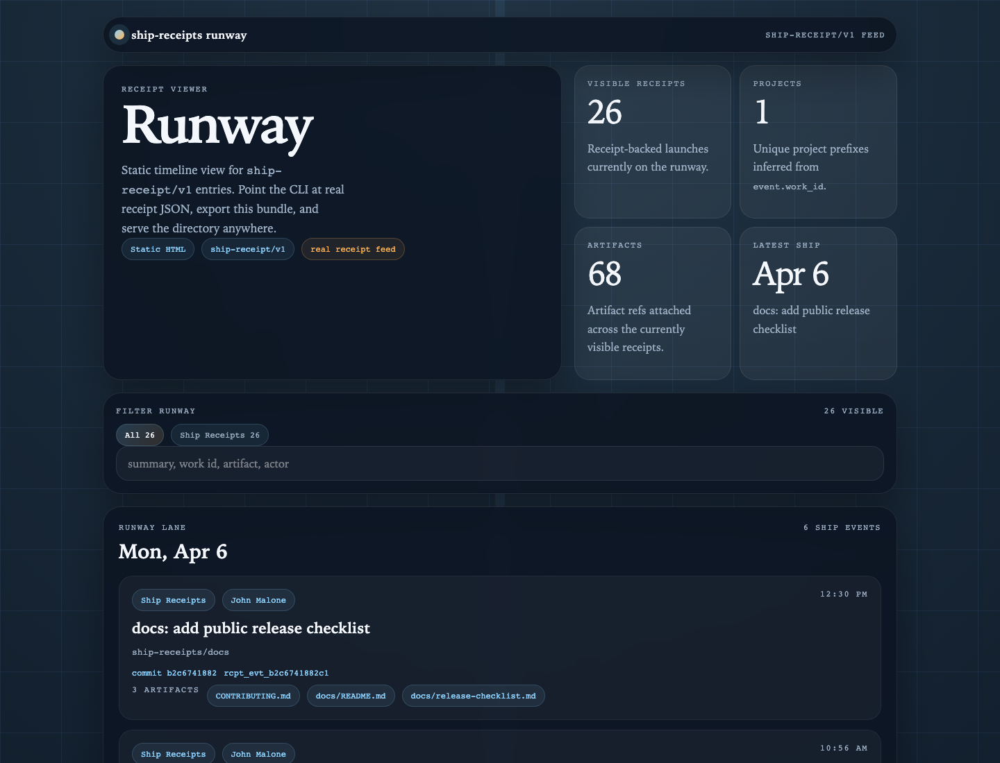
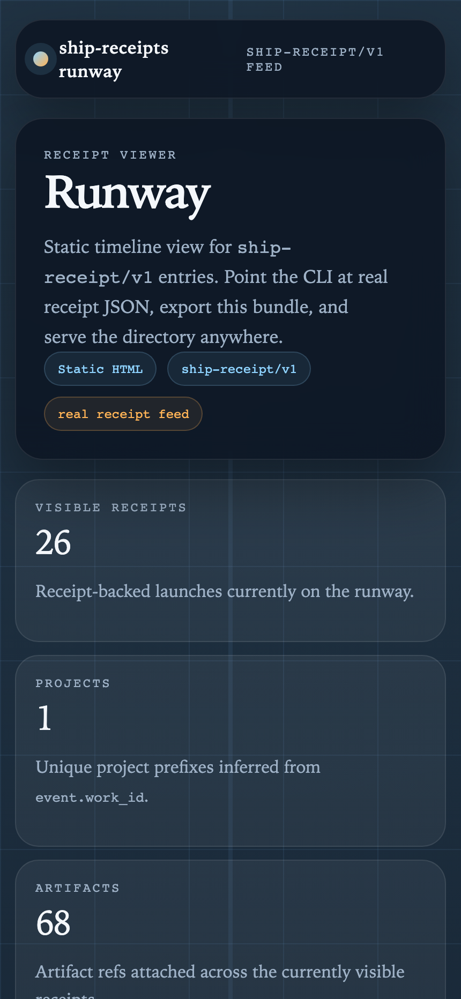

# Ship Receipts

[](https://github.com/Spitfire-Cowboy/ship-receipts/actions/workflows/ci.yml)
[](https://github.com/Spitfire-Cowboy/ship-receipts/actions/workflows/runway-pages.yml)
[](./package.json)
[](./LICENSE)
[](./docs/README.md)
[](https://github.com/Spitfire-Cowboy/ship-receipts/issues)

[Getting started](./docs/getting-started.md) · [Runway](./docs/runway.md) · [Game mode](./docs/game-mode.md) · [Concepts](./docs/concepts.md) · [Docs index](./docs/README.md)

CLI and JSON schema for recording work you actually shipped.

## Why it exists

Receipts over vibes: a receipt says what shipped, where it lives, who claims it,
and how someone else can check it.

## Features

- 🧾 **Local receipts** — create small, machine-readable claims for shipped work.
- ✅ **Validation** — check schema shape and optional content hashes.
- 📈 **Scoring** — track local state, streaks, goals, and daily progress.
- 🛫 **Runway export** — build a static timeline from receipts or recent git history.
- ⏱️ **OpenTimestamps** — anchor receipt digests with scoped timestamp proofs.
- 🎮 **Optional game layer** — reward better proof, not more busywork.

It is not a social network, badge farm, or global reputation service. This repo
is the local evidence layer; the separate `proofofship` verifier is the global
verification layer.

## Quickstart

Run the CLI:

```bash
npx ship-receipts --help
```

Develop locally:

```bash
npm install
npm run build
npm test
```

## Example workflow

Create a receipt:

```bash
ship-receipts create \
  --name "ship-receipts" \
  --kind repo \
  --url "https://github.com/Spitfire-Cowboy/ship-receipts" \
  --subject "Example Builder" \
  --output receipt.json \
  --hash
```

Validate it:

```bash
ship-receipts validate receipt.json
```

Score it into local state:

```bash
ship-receipts score receipt.json
ship-receipts streak
```

Build a static runway from recent git history:

```bash
ship-receipts runway build --from-git --days 30 --output-dir .runway
```

## Preview

<table><tr>
<td><a href="docs/assets/runway-desktop-view.png"></a></td>
<td><a href="docs/assets/runway-mobile-view.png"></a></td>
</tr></table>

## More information

- [Getting started](./docs/getting-started.md)
- [Runway guide](./docs/runway.md)
- [Game mode guide](./docs/game-mode.md)
- [Concepts](./docs/concepts.md)
- [OpenTimestamps setup](./docs/getting-started.md#opentimestamps)
- [Local/global trust boundary](./docs/concepts.md#proof-of-ship)
- [Repo map](./docs/site-map.md)
- [Release checklist](./docs/release-checklist.md)
- [Docs index](./docs/README.md)

## License

Apache 2.0. See [`LICENSE`](LICENSE).
