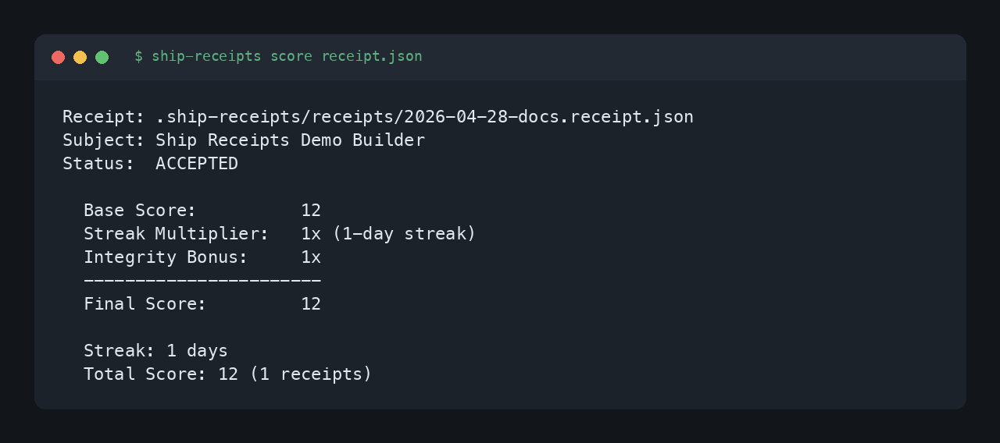
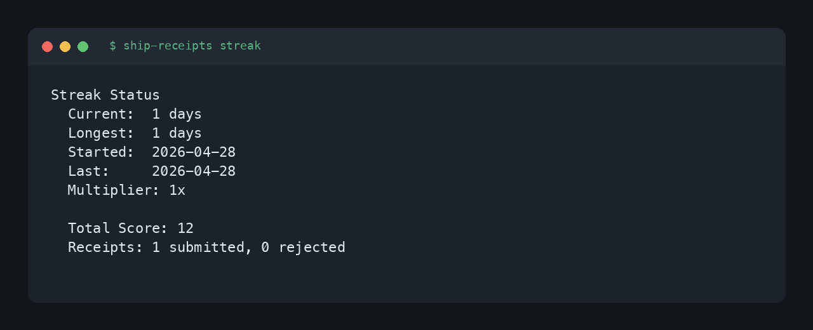
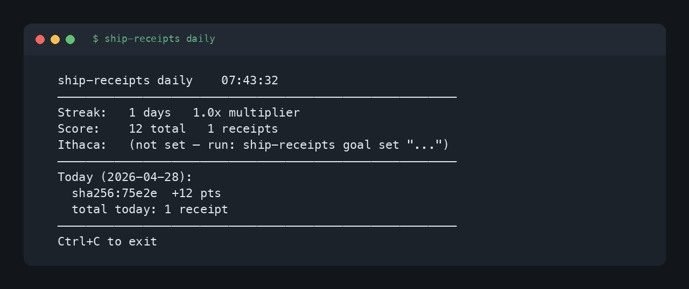
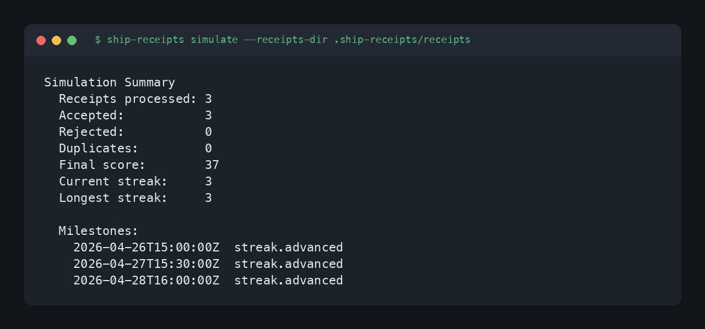
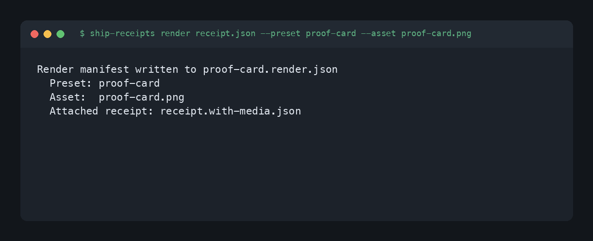
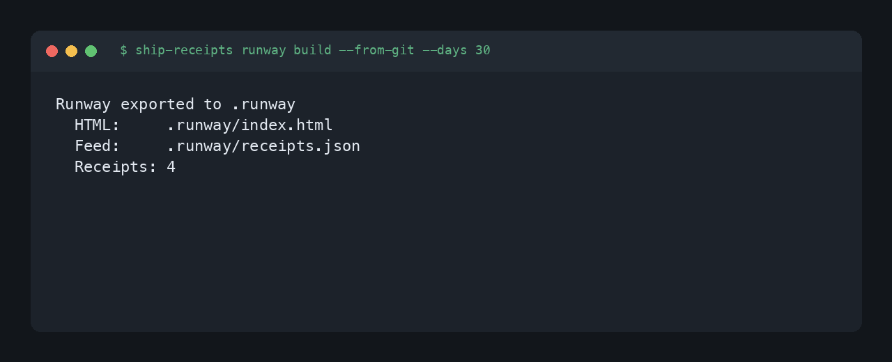

# Game Mode Guide

There is an optional game-flavored layer on top of the core receipt flow:
- local scoring
- streaks
- daily dashboard
- simulation
- ceremonial render hooks
- runway export

This is real enough to experiment with, but it is not yet a full game product.

For current status, read [docs/game-mode/README.md](./game-mode/README.md).

## Screenshots

These screenshots cover the game surfaces that are runnable today. The wider
party, guild, monk, siege, and hardware concepts are design backlog; they do not
have shipped UI screenshots yet.

| Mode | Screenshot |
| --- | --- |
| Score | [](./assets/game-mode-score.png) |
| Streak | [](./assets/game-mode-streak.png) |
| Daily dashboard | [](./assets/game-mode-daily.png) |
| Simulation | [](./assets/game-mode-simulate.png) |
| Render manifest | [](./assets/game-mode-render.png) |
| Runway export | [](./assets/game-mode-runway-build.png) |

## Screen reader notes

The game layer is CLI-first. Every runnable mode prints plain text, and the
structured modes also support JSON output where it is useful for automation.

Text equivalents for the screenshots:

| Mode | Text equivalent |
| --- | --- |
| Score | Shows receipt path, subject, accepted/rejected status, base score, streak multiplier, integrity bonus, final score, current streak, and total score. |
| Streak | Shows current streak days, longest streak, start date, last qualifying receipt date, multiplier, total score, and the next streak tier. |
| Daily dashboard | Shows current time, streak, multiplier, total score, receipt count, declared Ithaca goal if present, and today's recent receipts. |
| Simulation | Shows processed receipt count, accepted/rejected/duplicate counts, final score, current streak, longest streak, and milestone events. |
| Render manifest | Shows where the render manifest was written, the selected preset, asset path, and attached receipt path if one was written. |
| Runway export | Shows export directory, generated HTML path, generated feed path, receipt count, and skipped unsupported receipts if any. |

For screen readers, prefer append-only watch output so terminal history is not
cleared on every refresh:

```bash
ship-receipts daily --watch --no-clear
```

`--screen-reader` is accepted as an alias for `--no-clear`.

## Replay historical receipts

Run a dry simulation over receipts you already have:

```bash
ship-receipts simulate --receipts-dir .ship-receipts/receipts --json
```

This replays receipt timestamps through the game-state engine without mutating
live state. It is the easiest way to demo long-arc progression from real work.

## Attach a ceremonial render

Generate an asset elsewhere, then attach it to a receipt:

```bash
ship-receipts render receipt.json \
  --preset proof-card \
  --asset ./out/odyssey-proof-card.png \
  --output ./out/odyssey-proof-card.render.json \
  --attach ./out/receipt.with-media.json
```

What this does:
- writes a render manifest
- hashes the asset
- appends a `media[]` entry to a receipt copy
- recomputes the receipt content hash

Supported presets:
- `proof-card`
- `streak-bumper`
- `ritual-clip`

Supported formats:
- `png`
- `gif`
- `mp4`
- `ascii-gif`
- `ascii-mp4`

## Keep the game mode ambient

The intended shape is:
- ship real work
- let receipts advance the world
- let the CLI show slow narrative progress over time
- trigger ceremonial bumpers when something real ships

That keeps the loop legible without turning it into manipulative busywork.
